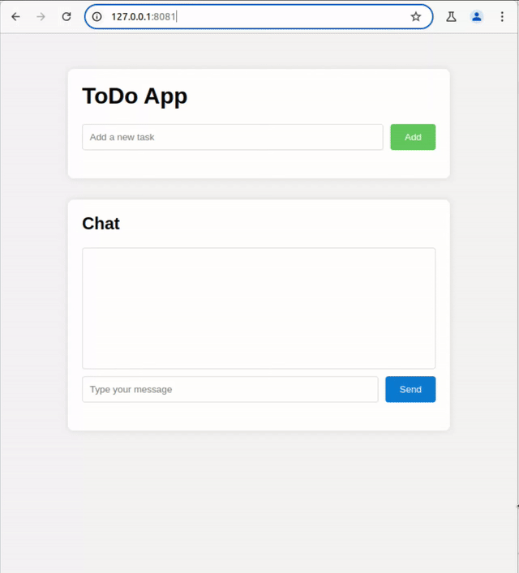

# LLMOrrery - PoC for WEB APPs run by LLMs


## Introduction
LLMOrrery is a prove of concept of the idea that you can run any software in LLMs: Instead of having a LLM write the code of the app and than run it separately, one can run the app in the LLM directly and have it handle all task from creating the GUI to doing all the program logic. Some AI experts think that this is how we might run software in the future, which is why I wanted to test this in a minimal setup: For this I use flask to create a simple HTTP Server which forwards all requests to the LLM which evaluates them, together with the request history and then returns its answer as HTML code. What kind of functionally the app has is defined by the system message, which can be provide by a config file together with the preferred LLM for it. In the example folder there are three examples showcasing the concept.

Interestingly this works better than expected: With the more complex models like GPT4o it works better, but even a llama3.1 7b model can come up with some decent result now and then. Independent of the model you might have to reset the app several times to get a decent functional app, but when you get one, you can get some promising results. Resetting is done by either restarting the software or by calling the reset URL (http://127.0.0.1:8080/reset).

The best current show case is the ToDo app example with chat functionality where you can add your tasks, as one expect it, but you can also ask the app to switch to night mode and back or add a button for it, which was never programmed into it. Here, you can see a speed up screen cast of one such session:




Nevertheless the app that work are currently rather simple and there is still a way to go until this becomes useful. But this is an interesting idea which might have some potential in the future. Especially together with tool calling this might be a powerful combination to create fully flexible GUIs without doing any coding.

## Warning
It goes without saying, but don't use this on any kind of production service: LLMs are know to hallucinate and make up things, so don't trust the results at all. It is just a fun project to learn more about LLMs and how they can be used.

## Installation
Tested on Linux only, but there is noting which should stop you from running it elsewhere.
### Requirements
- Python 3.10 or higher
- Ollama for local models
- OpenAI API Token for OpenAI models
- A lot of patience
### Installation Steps
* Clone the repo:
```bash
$ git clone https://github.com/mpeuten/LLMOrrery.git
```
* Go into the directory:
```bash
$ cd LLMOrrery
```
* Create a virtual environment:
```bash
$ python3 -m venv venv
```
* Activate it:
$ source venv/bin/activate
```
* Install the required python packages:
```bash
$ pip install -r requirements.txt
```
* Run the server with on of the examples:
```bash
$ python3 llmorrary.py -c examples/AI_website.yaml
```
All done, have fun experimenting.

## Setup
The OpenAI API key, endpoint URL as well as other model provider options can be set with a `.env` file, just copy over the example file:
```bash
$ cp sample.env .env
```
Open the `.env` file and uncomment the relevant lines as well as fill in the missing values.
## Calling
The program signature is:
```bash
$ python llmorrery.py
usage: llmorrery.py [-h] -c CONFIGFILE [-H HOST] [-p PORT] [-m MODEL] [-l LOGPATH]
llmorrery.py: error: argument -c/--config: expected one argument
```
The only required parameter is the config file, which contains all the information about the LLM and the prompts to use. The other parameters are optional: The host and port options are there if you want to change the host/IP address and/or TCP port the software is listening to. The Model options allows to override the model given in the config file. And the logpath specifies the directory in which the log files are written, if not specified it will be the same as the directory the config file is from. Note the logfiles themselves have the same format as the config files and can therefore be used to, for example, continue a previous session.

## Examples
In the examples folder you can find three simple examples, showing what is possible. You will have to reset (either by restarting or calling the reset URL) several times if the results don't work or missing an important aspect. As I didn't spend to much time on the prompts, so improving them will defiantly help with getting better results.

### Homepage of an AI startup
This APP is a webserver for a simple AI Startup webpage using LLAMA3.1-7b for the request. Run it with:
```bash
$ python3 llmorrery.py -c examples/AI_website.yaml
``` 
### 4th grade math quiz
A simple math quiz for 4th grade school children: It ask you a math question and you have to answer it correctly. Uses OpenAIs gpt4o-mini, run it with:
```bash
$ python3 llmorrery.py -c examples/4th_grad_math_quiz.yaml 
``` 
### ToDo app with Chat interface
Simple ToDo app with a chat interface: You can add, remove and list tasks with the normal UI buttons, but you can also use the chat window to do so. Furthermore you can ask it to change the layout of the page or add new features to it. Uses OpenAI gpt4o, run it with:
```bash
$ python3 llmorrery.py -c examples/todo_chat.yaml 
``` 

## Config file options
### General
- YAML file with a `.yaml` extension
- Contains 3 sections:
    - `description`: Description of the software in the file
    - `model`: Model specific settings
    - `prompt`: Prompt of the software 

### Description
Contains a description of the software in the file. 
- `name`: Name of the software
- `version`: Version of the software
- `author`: Author of the software
- `description`: Description of the software
- `license`: License of the software
This is currently not use by the software but might help to understand what it is for.

## Model
Contains model specific settings.
- `model`: Model to use (e.g. `ollama:llama3.1`, `openai:openai:gpt-4o-mini`), always a combination of model provider + ":" + model name. Currently following providers are supported:
- - openai
- - ollama

## Prompt
Contains the prompt of the software, which is a list of at least one to many messages
containing the role and content of the message. The first message should always be the system message.
- `role`: Role of the message (e.g. `system`, `user`, `assistant`)
- `content`: Content of the message

## BUGs
- context length is not check or limited in any form, this can become problematic

## Possible future extensions
- Support HTTP POST 
- Function calling support
- Options to have a session per user and not per server
- Add groq support
- Some form of long term memory

## License
MIT License

Copyright (c) 2024 Miklos Peuten

Permission is hereby granted, free of charge, to any person obtaining a copy
of this software and associated documentation files (the "Software"), to deal
in the Software without restriction, including without limitation the rights
to use, copy, modify, merge, publish, distribute, sublicense, and/or sell
copies of the Software, and to permit persons to whom the Software is
furnished to do so, subject to the following conditions:

The above copyright notice and this permission notice shall be included in all
copies or substantial portions of the Software.

THE SOFTWARE IS PROVIDED "AS IS", WITHOUT WARRANTY OF ANY KIND, EXPRESS OR
IMPLIED, INCLUDING BUT NOT LIMITED TO THE WARRANTIES OF MERCHANTABILITY,
FITNESS FOR A PARTICULAR PURPOSE AND NONINFRINGEMENT. IN NO EVENT SHALL THE
AUTHORS OR COPYRIGHT HOLDERS BE LIABLE FOR ANY CLAIM, DAMAGES OR OTHER
LIABILITY, WHETHER IN AN ACTION OF CONTRACT, TORT OR OTHERWISE, ARISING FROM,
OUT OF OR IN CONNECTION WITH THE SOFTWARE OR THE USE OR OTHER DEALINGS IN THE
SOFTWARE.